# 修改情况

## 幂律

修改内容：

- 按照要求重新加工了map的4个块
- 依据新的map块，修改了案例的内容部分

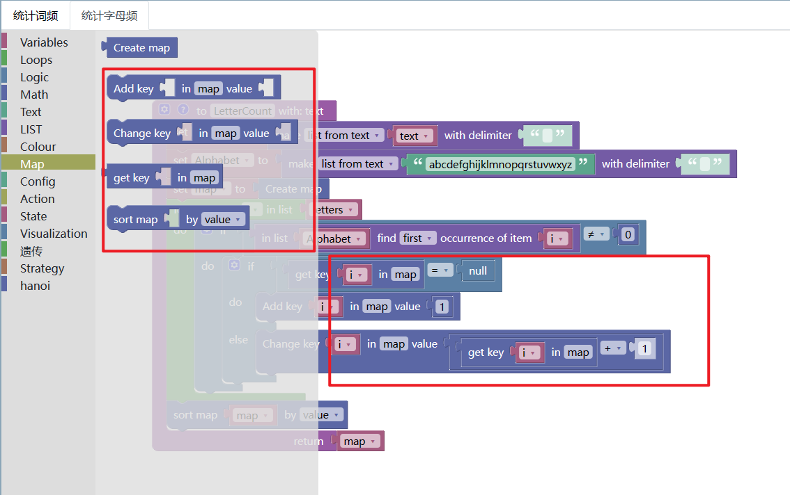

## 方程图像

- 经过和官方的核对，在Math类别中增加了缺少的1个块： sum of list
- Math类别中，自定义了新的块，即log数学函数。可以自定义底和真数。
- 增加可视化坐标轴的xlim和ylim，可以自定义。
- 将只能绘制一条线条，修改为可同时绘制多条线条。

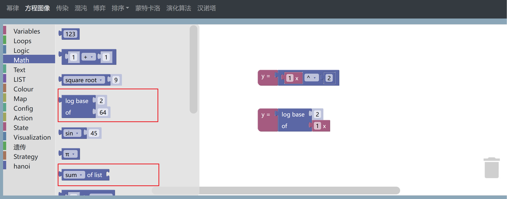

点击Update按钮之后

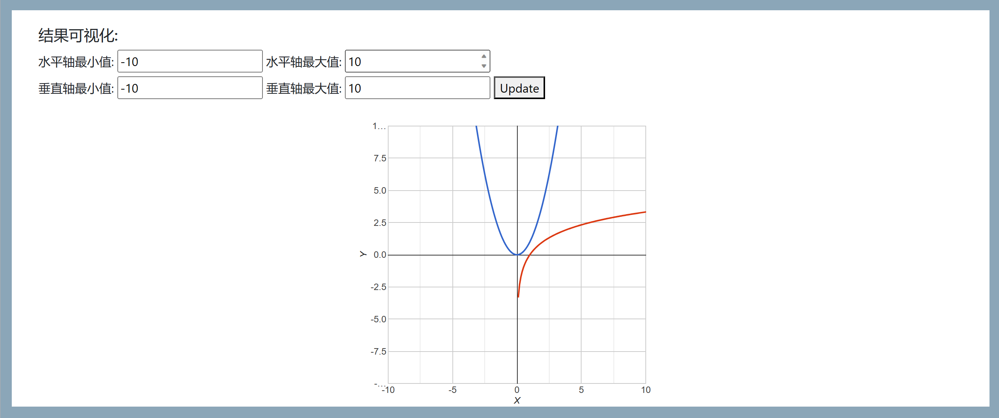

## 排序

- 修改增加了之前忘记加的function类
- 修改了variable类，增加了之前忘记加上的一个块

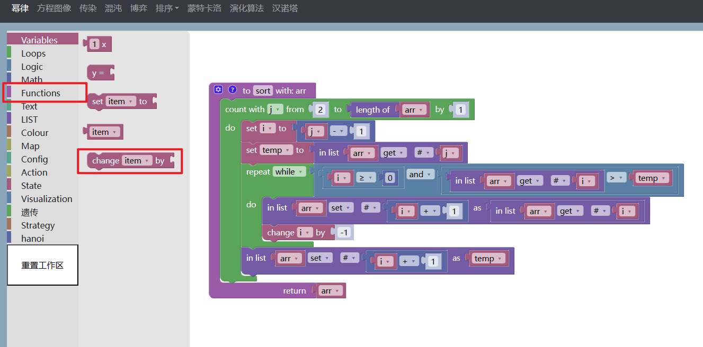

## 蒙特卡洛

- 增建了Math类别中的 生成正态分布随机数的blockly块

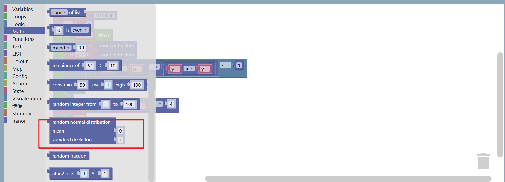

- 魔改图像增加了坐标轴，源代码使用了canvas画图，感觉这个方法很难用，导致坐标轴需要纯手工绘制。。

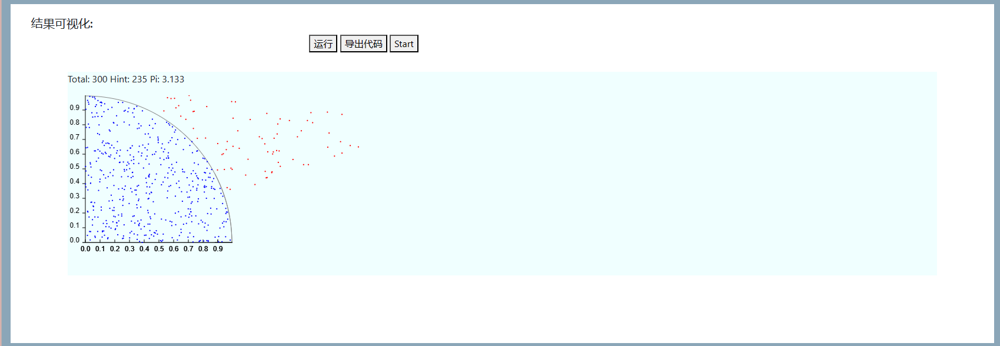

## 汉诺塔

- 增加了一个柱子块，这样更易读（只能是按照顺序，柱子123，不能改成其他的柱子abc或者柱子012之类的）

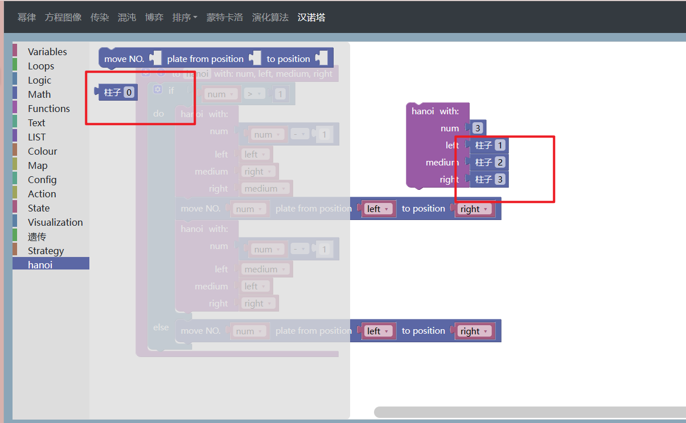

## 增加随机人生案例

- blockly示例

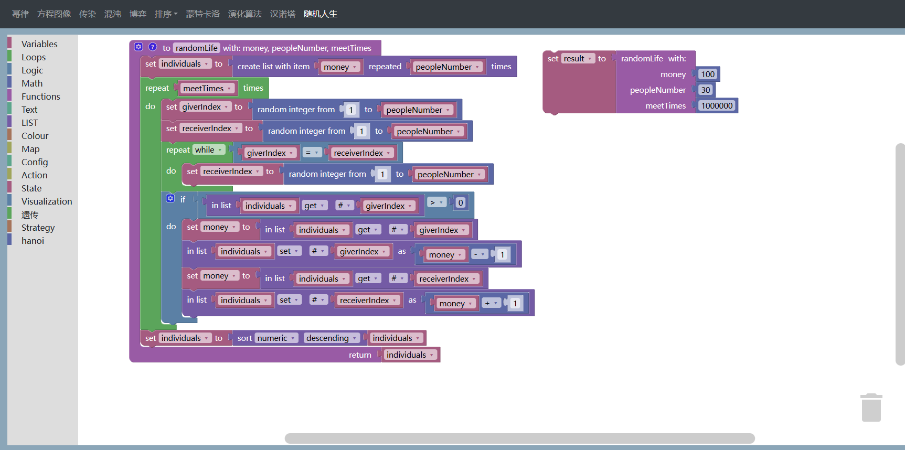

修改了导出代码的样式

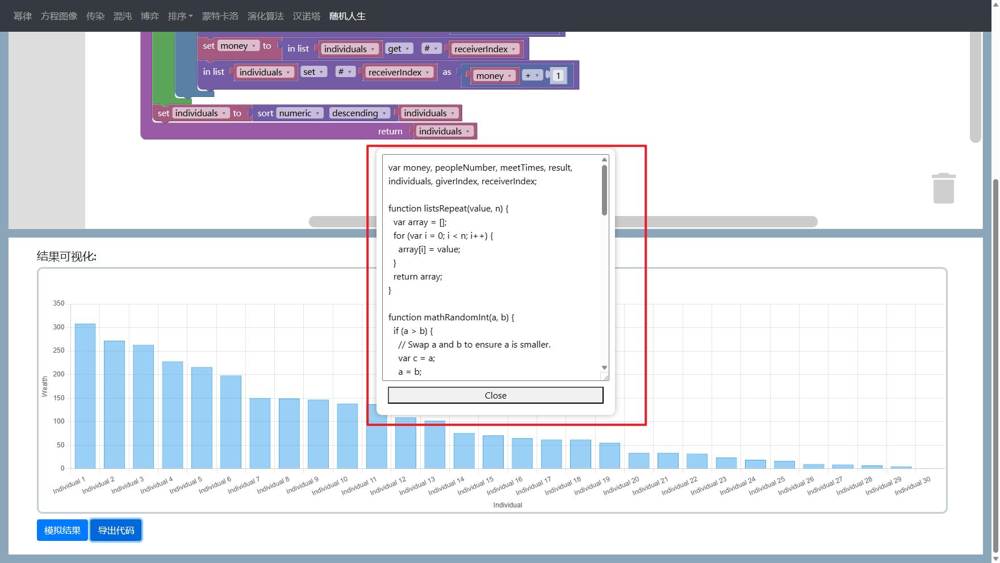

可视化结果如下

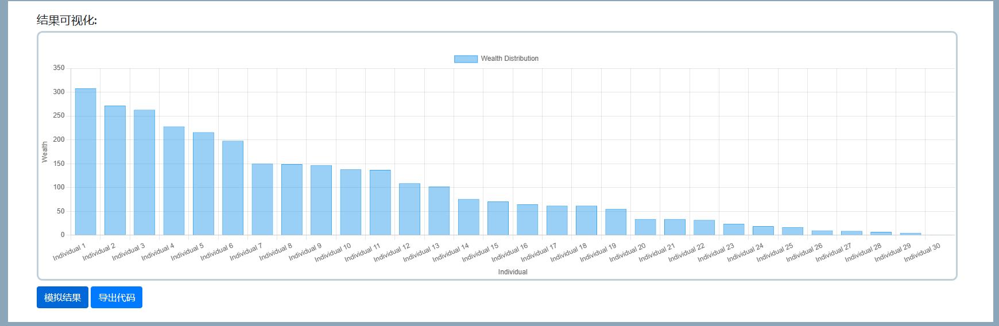

## 增加三门案例

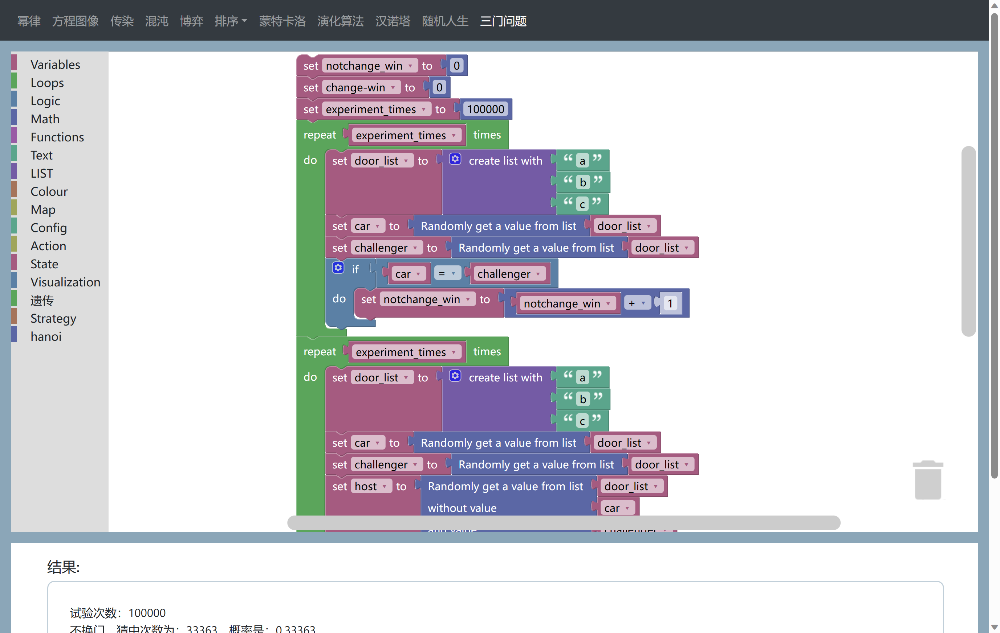

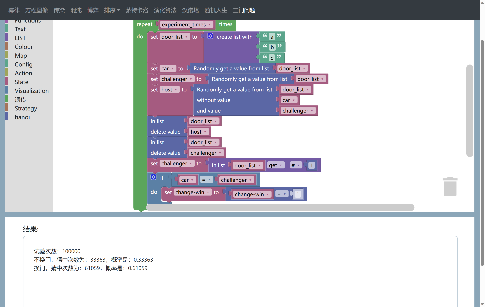

list里面增加了几个块

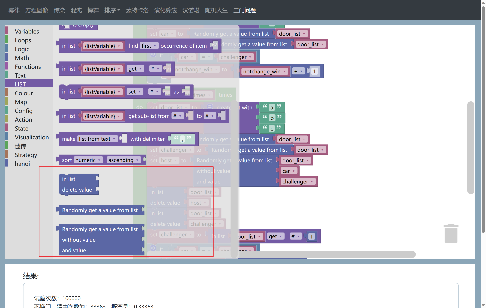

## 增加科赫曲线案例

为了方便计算，增加了一些块

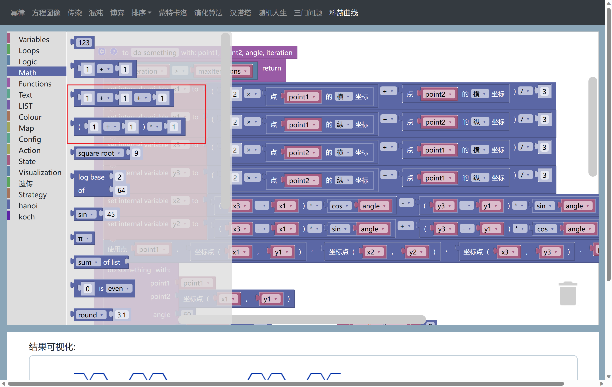

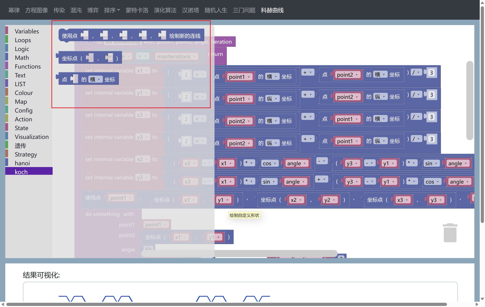

结果如下：

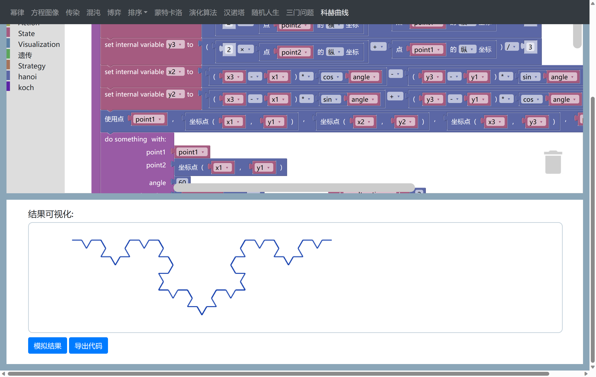
