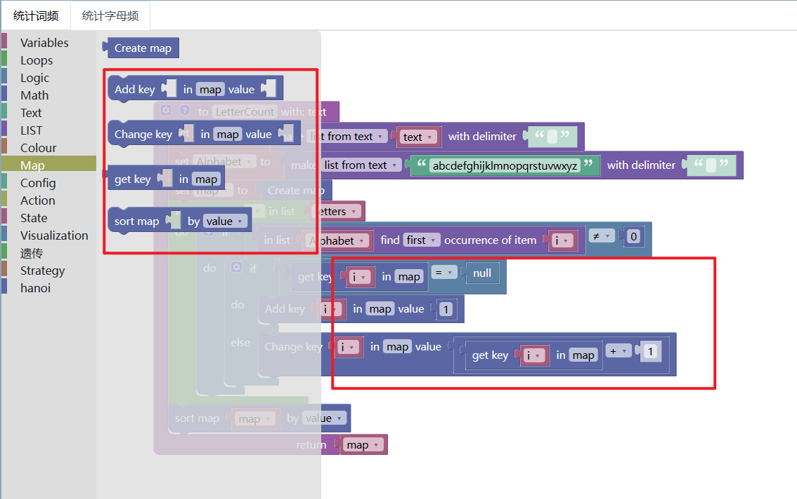
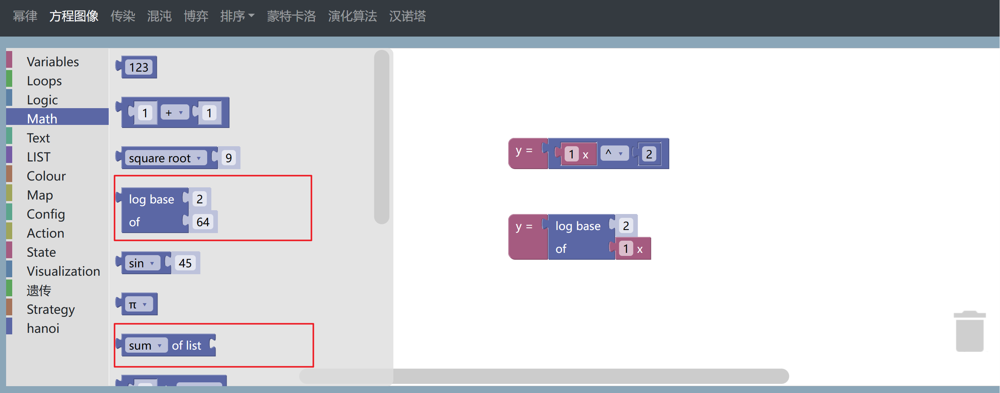
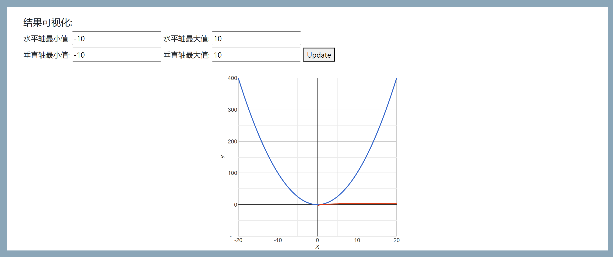

# 修改情况

## 幂律

修改内容：

- 按照要求重新加工了map的4个块
- 依据新的map块，修改了案例的内容部分

## 方程图像

- 经过和官方的核对，在Math类别中增加了缺少的1个块： sum of list
- Math类别中，自定义了新的块，即log数学函数。可以自定义底和真数。
- 增加可视化坐标轴的xlim和ylim，可以自定义。
- 将只能绘制一条线条，修改为可同时绘制多条线条。

点击Update按钮之后

## 
